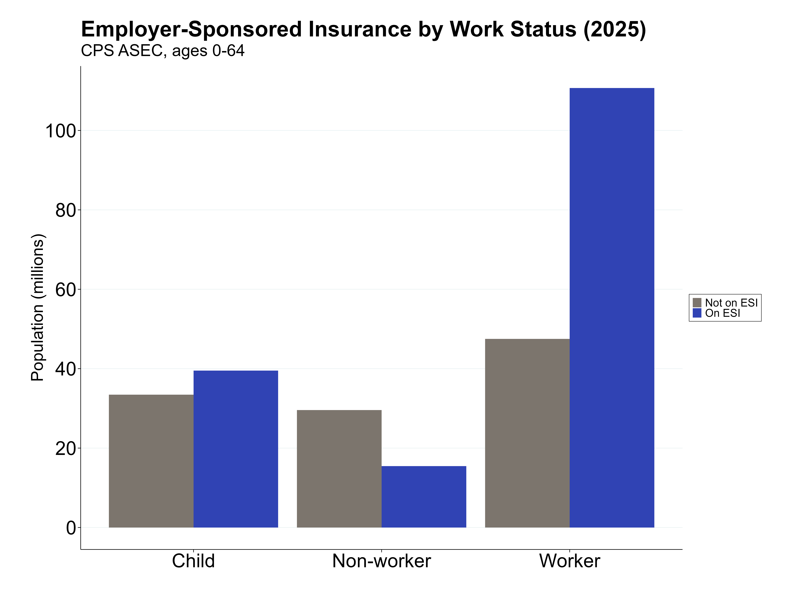
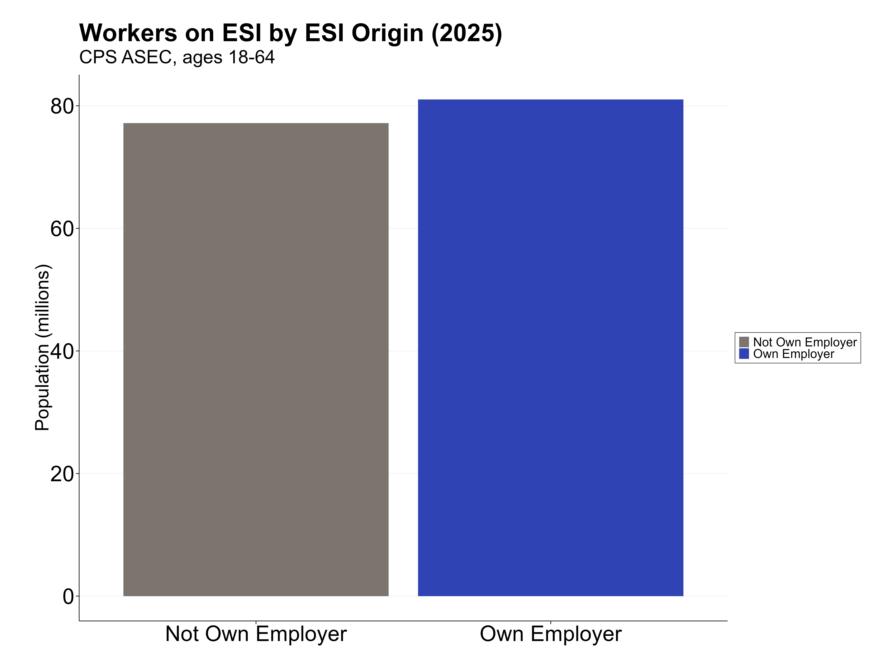

## Current Population Survey - Annual Social and Economic Supplements (2025) 
https://www.census.gov/data/datasets/time-series/demo/cps/cps-asec.html 

### How many non-elderly workers (aged 18-64) are on ESI.
- 110,681,349 adult workers are on ESI
- 15,446,728 adult non-workers are on ESI
- 39,520,250 children are on ESI
- 165,648,327 people age 0-64 are on ESI
- 177,952,703 total people are on ESI (age 0-85)

### How many non-elderly workers (aged 18-64) are on ESI from their own employer.
- 81,023,761 working adults are on ESI from their own employer

### How many non-elderly workers (aged 18-64) are on ESI from another family member (family plan).
- 26,314,974 working adults are on ESI from a family plan

